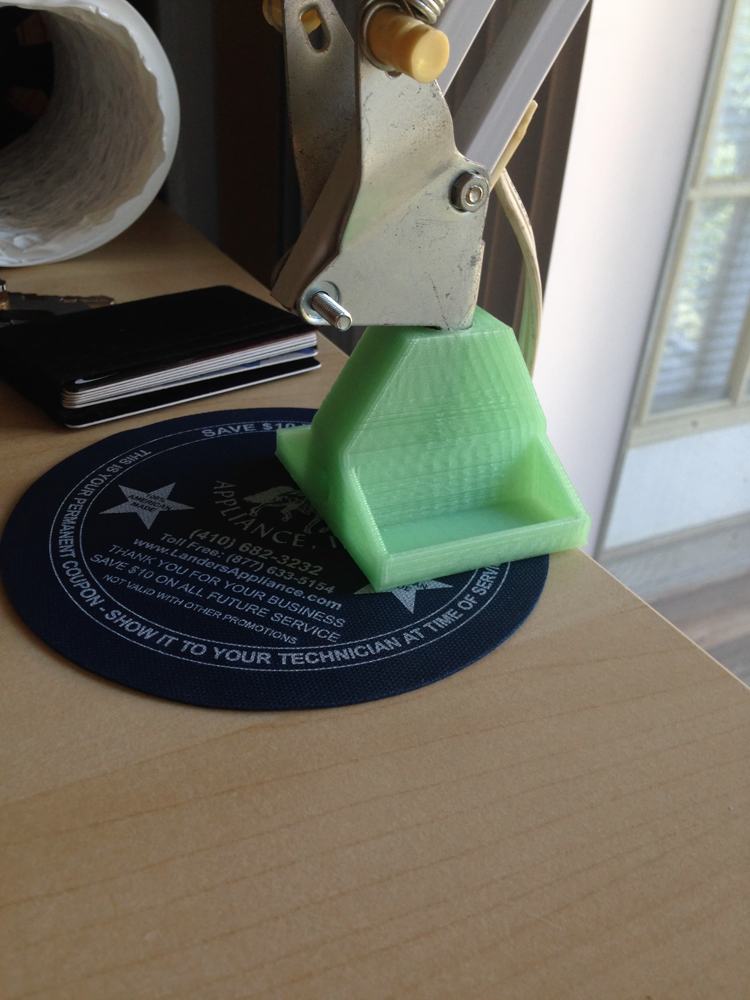
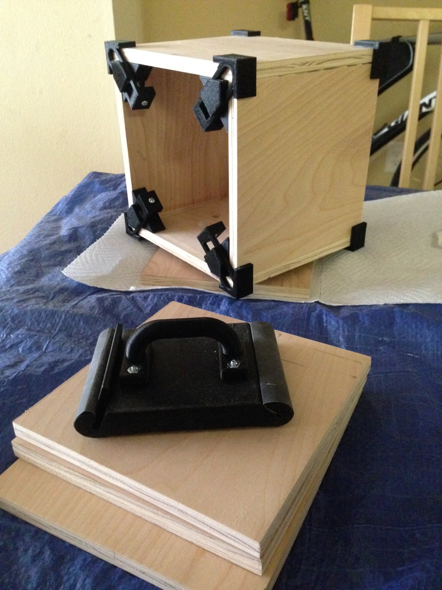
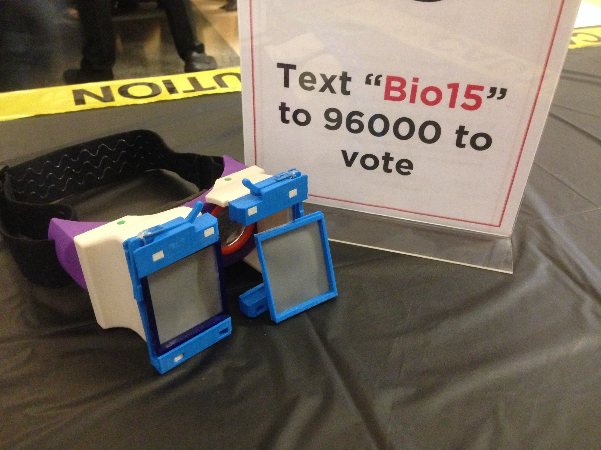

## Summary

At the University of Maryland, I had access to a laser cutters, CNC milling, and a variety of 3D printers. I built a solder fume extractor, a replacement stand for my lamp, a mount for a bike light, VR Goggles for my [senior capstone project](CAPSTONE.html), and a microfluidic temperature stage for [undergraduate research](microfluidics.html) among other projects.

## Solder Fume Extractor

I built a solder fume extractor using an old fan leftover from a freshmen year engineering course, 3D printed parts, and an Arduino. I wrote a simple Arduino script that modulates the fan speed based on a potentiometer dial. On the back of the fan is a 3D printed ventilation grille that can also hold a carbon air filter sheet. On the front is an adapter to connect to a ventilation hose

3D Printed Components:

Arduino Controller:

In Use in my old apartment:

## Replacement Lamp Base

The original IKEA base for this lamp shattered in half, so I redesigned and printed a replacement base.

The broken lamp base:

The new and improved version:

## Bike Light Adapter

My panniers obscure my bike post-mounted rear tail light and I needed a more visible mount to make commuting safer. The mount bolts right onto the rear rack and to the bike light. In the next version, the light will sit nearly flush to the rear rack to reduce the likelihood of being knocked off.

The mount fit right into the bike rack and had nibs to hold the light in place and nut cutouts to make installation easier:

The bike light adapter:

## Adjustable Corner Clamp

To build a small speaker box, I designed a corner clamp that can be adjusted to fit wood between 1/8" - 1" thick. Once printed, you need a single dime and then an M3 nut and bolt.

The corner clamp in use:

I also modified a sanding block I found online:

## Other Projects

My other rapid prototyping were part of larger projects that are described in detail elsewhere. Click the below links to learn more:

[My capstone project prints:](CAPSTONE.html)

[My undergraduate research project prints:](microfluidics.html)

