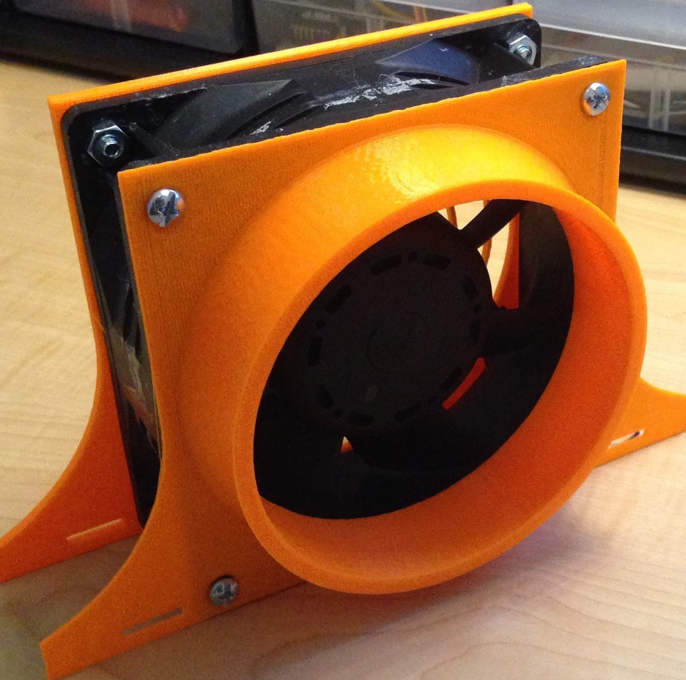
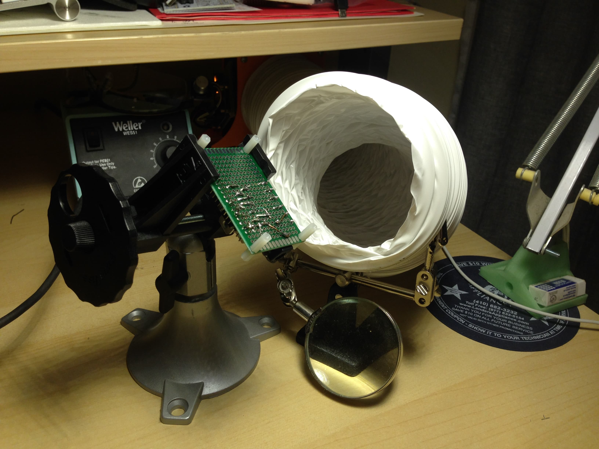
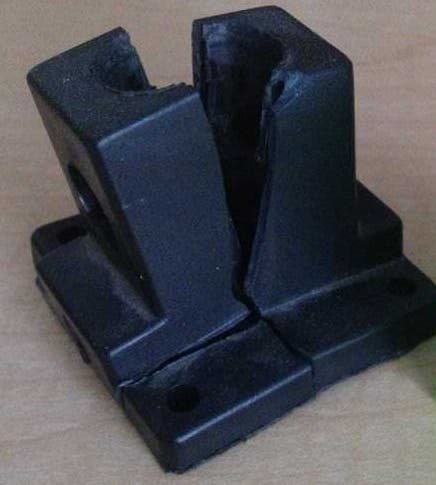
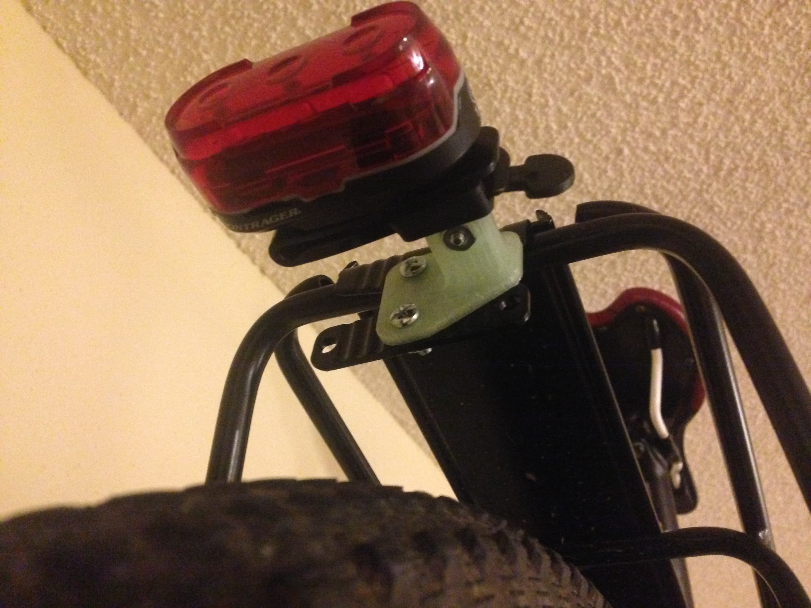

# 3D Printing at UMD

At the University of Maryland, I had access to a laser cutters, CNC milling, and a variety of 3D printers. I built a solder fume extractor, a replacement stand for my lamp, a mount for a bike light, VR Goggles for my [senior capstone project](./2016-Capstone.md) and a microfluidic temperature stage for [undergraduate research](./2016-Microfluidics.md) among other projects.

<!-- more -->

## Solder Fume Extractor

I built a solder fume extractor using an old fan leftover from a freshmen year engineering course, 3D printed parts, and an Arduino. The Arduino modulated the fan speed based on a potentiometer dial. On the back of the fan is a 3D printed ventilation grille and optional carbon air filter sheet, while the front connects to a ventilation hose.

<!-- TODO: Should I use attributes for styles? -->

{: .custom-class }

## Replacement Lamp Base

The original IKEA base for this lamp split in half, so I redesigned and printed a replacement base.

## Bike Light Adapter

My panniers obscure my bike post-mounted rear tail light and I needed a more visible mount to make commuting safer. This mount bolts onto my bike's rear rack and had was designed to make installation easier:

## Adjustable Corner Clamp

To build a small speaker box, I designed a corner clamp that can be adjusted to fit wood between 1/8" - 1" thick. Once printed, you need a single dime and then an M3 nut and bolt. I also modified a sanding block I found online:

## Other Projects

My other rapid prototyping were part of larger projects that are described in detail elsewhere. Click the below links to learn more:

[My capstone project prints:](./2016-Capstone.md)

[My undergraduate research project prints:](./2016-Microfluidics.md)

<!-- TODO: Reference Links -->

<!-- [TBD?]: link? -->
