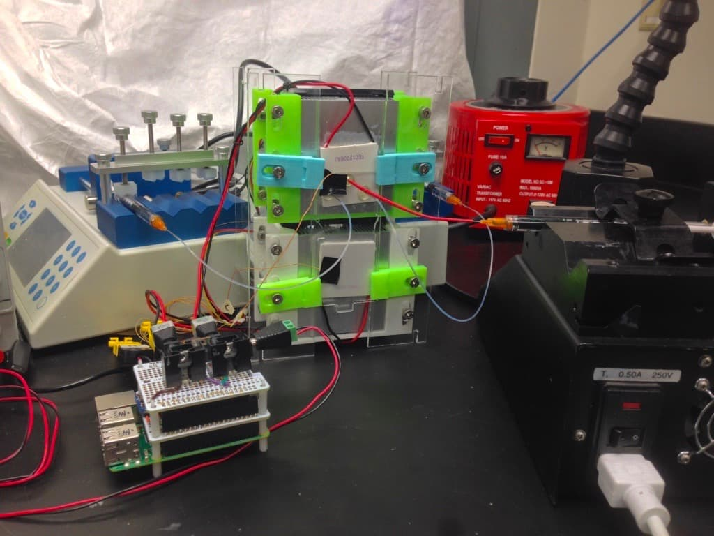

# Microfluidic Researcher

As an undergraduate researcher in the UMD MEMS and Microfluidics Lab (MML), I pioneered a bead-based immunoassay for Ebola detection with a simple trick to improve optical clarity of an otherwise translucent matrix.

Quick and efficient disease diagnostics require precision, innovation, and ingenuity. Current diagnostic tests are often performed by lab technicians and can take 12 to 24 hours to heed results. Accurate and reliable results can influence treatment plans and avoid unnecessary follow up appointments. I developed a very-early prototype of a potentially rapid, microfluidic technology that simplifies the diagnostic process. The final product could be integrated into a sample preparation device to be used by a variety of audiences including primary care physicians and doctors in developing countries.

<!-- more -->

<!-- FIXME: Undergraduate Research Day Poster ::: -->

## The Technology

In an immunoassay, the rate limiting step is diffusion time for the analyte to interact with an activated surface. Our solution involves an efficient matrix of activated low melting point (LMP) agarose beads. The large surface area of the beads result in little to no delays in diffusion time, allowing for rapid binding reactions and the identification of small concentrations of analyte. Quantifying the amount of analyte requires a specific technique to overcome the opaque nature of the capture matrix. Typically, an additional fluid would be introduced to reduce the effects of light scattering and improve clarity. Unfortunately, an index-matching solution must be very viscous to match the optical properties of the matrix material leading to air bubbles, clogging, and increased device complexity. Instead, LMP agarose beads can be melted by an external heater to create a solid and transparent mass. External heaters allow for greater control, speed, and reduced complexity.

## Challenges

- Assess the validity of our assumption that melting agarose beads is feasible and has an optical improvement
- Determine an effective chemical reaction to activate the agarose surface and detect the target analyte
- Create ~30 µm diameter LMP agarose beads in large quantities, eliminate clogging, and maintain high consistency in size distribution to avoid bead coalescing
- Verify the assay in a sample end device

### Conducting a "Sanity Check"

The assay relied on the idea that melting agarose would provide optical improvement and could be achieved inside a COC-plastic chip. Testing the theory, I packed an over-sized bead bed into a COC chip. The images show the bead bed at room temperature before melting, then after melting in an oven at 80°C for one minute.

A comparison of before and after heating LMP Agarose beads inside a COC microfluidic chip

<!-- FIXME: id="bead-bed" class="small-juxtapose" -->

An separate view of the above COC chip prior to bead packing. The region of interest from the prior image is marked with the orange arrow:

### Selecting the Chemical Reaction

Through my research, I found several viable options for activating agarose. I selected a reaction that was stable between 0-100°C and could be modified for various end applications (Spencer, Melo, Perez, & Weller, 2005). I then activated 2 mm diameter agarose beads and demonstrated positive and negative controls, both before and after melting. The results were encouraging that the positive controls were visually discernible from the negative controls along with the demonstration that the optical improvement was possible while maintaining the stability of the chemical reaction.

Large agarose beads used to demonstrate chemical reaction:

### Producing Agarose Beads

The micro-scale agarose beads intended for the final device were generated using a microfluidic co-flow droplet generator. Liquid agarose is pumped into an intersection with silicone oil, an immiscible fluid. The shear stress of the intersection allows for continual flow of agarose droplets at a steady rate. Below is a video of one of my generators in action:

Water in oil droplet generation. Filmed on iPhone for higher frame rate:

The device seen in the video is first milled from polycarbonate (PC), bonded to a second, thinner layer of PC through heat and pressure. Brought slowly back to room temperature, the needle ports are pressed and attached to syringe pumps.

The microfluidic chip is about to milled before bonding:

Once assembled, the chip was mounted onto the heat stage as shown above. The orange arrow is pointing to the microfluidic channel intersection:

Maintaining optimal temperature within the microfluidic chip serves a critical and challenging role in agarose bead production. At room temperature, agarose solidifies into a gel that can alter internal pressures and flow rates or clog the microfluidic chip.

To maintain temperature control, I built Turtle-Bot, a rapidly prototyped platform nicknamed for its 4 acrylic legs. The microfluidic chip is placed on two peltier tiles, one around 40°C and the second around 5-10°C. A raspberry pi with a PID controller controls each peltier tile based on the thermocouple temperature readings and modulates the fans for the active heat-sinks. The electronics were soldered onto perfboard and mounted onto the top of the Raspberry Pi to save space and condense the setup from the initial implementation to the more compact second generation.

Microfluidic Droplet generator generation one:

Microfluidic Droplet generator generation two:

### Key Takeaways

- LMP agarose melts between 70-85°C and can be melted inside a microfluidic chip
- A hydrazide reaction can be used to functionalize agarose for antibody-based detection
- Through selective heating and cooling, agarose droplets can be made with a diameter smaller than 30 µm

### Works Cited

[Spencer, L., Melo, R., Perez, S., & Weller, P. (2005). A gel-based dual antibody capture and detection method for assaying of extracellular cytokine secretion: EliCell.*Methods in Molecular Biology*(Clifton, N.J.).](http://www.ncbi.nlm.nih.gov/pubmed/15937360){style="font-style: italic"}
